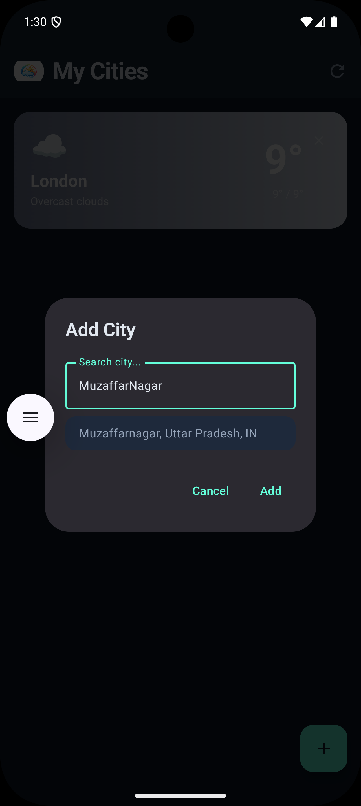
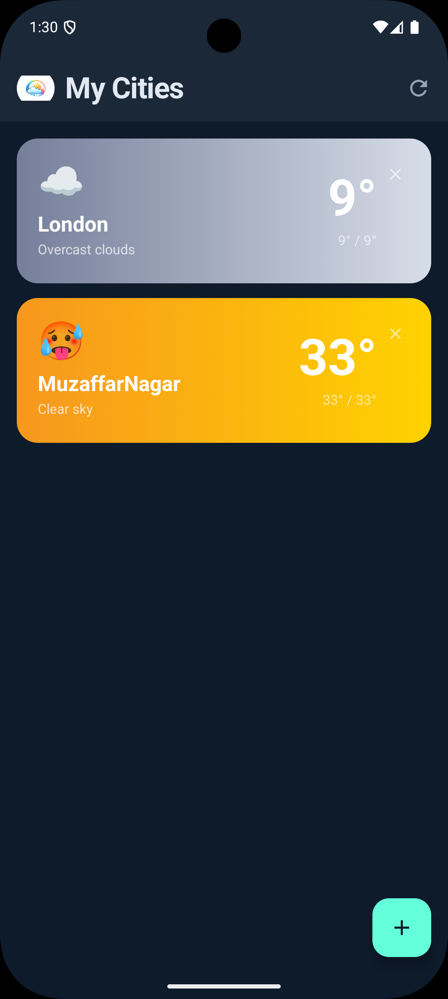
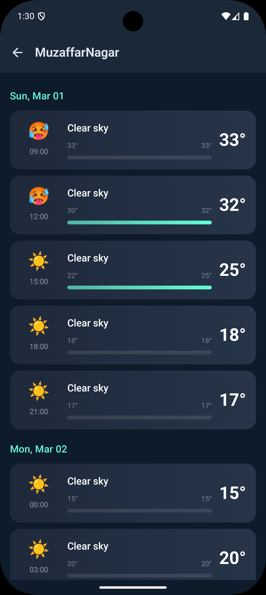

# Weather App

A personal Android project I built to practice Clean Architecture with a real-world use case. It's a multi-city weather dashboard that lets you track weather for up to 5 cities, search by name with live suggestions, and check a detailed 5-day forecast — all with a deep navy dark theme.

## Screenshots

<p align="center">
  
  
  
</p>

## What it does

- **Multi-city dashboard** — add up to 5 cities and see current weather for all of them on one screen. Starts with London by default on first launch.
- **City search with suggestions** — type a city name and get autocomplete suggestions from the OpenWeatherMap Geocoding API. Search is debounced (300ms) so it doesn't hammer the API on every keystroke.
- **5-day forecast** — tap any city card to see a detailed forecast with temps grouped by day and a visual temperature bar.
- **Offline support** — weather data is cached in a local Room database so the last fetched data is always available, even without internet.
- **Remove cities** — swipe or tap to remove a city from your dashboard.

## Architecture

Follows Clean Architecture with a clear separation between data, domain, and presentation layers. The domain layer has zero Android dependencies — it only knows about models, repository interfaces, and a `Result` wrapper.

```
app/src/main/java/com/nyinnovations/androidcleanarchitecturesample/
├── data/
│   ├── di/             # Hilt modules (network, database bindings)
│   ├── local/          # Room database, entities, DAOs
│   │   ├── dao/
│   │   ├── entity/
│   │   └── WeatherDatabase.kt
│   ├── mapper/         # Data <-> Domain model conversion
│   ├── remote/         # Retrofit API interfaces + response DTOs
│   │   ├── dto/
│   │   ├── WeatherApi.kt
│   │   └── GeocodingApi.kt
│   └── repository/     # WeatherRepositoryImpl
├── domain/
│   ├── model/          # Clean domain models (no JSON annotations)
│   ├── repository/     # WeatherRepository interface
│   └── util/           # Result.kt (Success / Loading / Error)
├── presentation/
│   ├── weather/        # WeatherScreen, WeatherViewModel, WeatherUiState
│   └── forecast/       # ForecastScreen, ForecastViewModel, ForecastUiState
├── ui/theme/           # Deep navy dark theme, colors, typography
├── MainActivity.kt
└── WeatherApplication.kt
```

The ViewModel talks directly to the repository interface — I removed the use case layer since the business logic here wasn't complex enough to justify the extra indirection.

## Tech stack

- **Kotlin** + Coroutines + StateFlow
- **Jetpack Compose** + Material 3
- **Hilt** for dependency injection (with KSP)
- **Retrofit 2** + OkHttp 4 + Gson for networking
- **Room** for local caching and saved cities
- **Navigation Compose** for screen navigation
- **OpenWeatherMap API** — current weather + 5-day forecast + geocoding

## Setup

### 1. Clone the repo

```bash
git clone https://github.com/nyadav1992/Weather_App.git
```

### 2. Get an API key

You'll need a free API key from [OpenWeatherMap](https://openweathermap.org/api). The free tier covers current weather, forecast, and geocoding — which is all this app uses.

Once you have it, open `WeatherRepositoryImpl.kt` (inside `data/repository/`) and replace the API key placeholder:

```kotlin
const val API_KEY = "your_openweathermap_api_key"
```

> Tip: for anything beyond local dev, move the key to `local.properties` and expose it via `BuildConfig` so it doesn't end up in version control.

### 3. Run it

Open in Android Studio, let Gradle sync, and hit Run. Requires min SDK 24.

## Project notes

- The app seeds **London** as the default city on first install. You can remove it.
- Max **5 cities** can be tracked at once. Adding a 6th shows an error toast.
- Search suggestions kick in after typing **2+ characters**, debounced at 300ms.
- The forecast screen groups 3-hour API data into day buckets and renders a simple temperature range bar for each day.

## Requirements

- Android Studio Hedgehog+
- Min SDK 24 / Target SDK 36
- Java 11

## License

MIT
